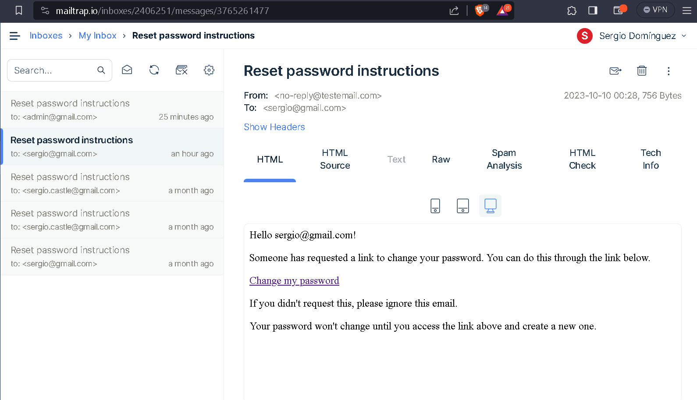
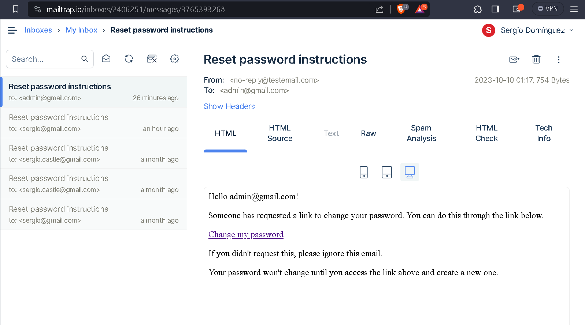

Descripción
Nuestro cliente Gonzalo, busca lanzar su nuevo sitio de noticias llamado “TheRialNews”
donde en forma satírica informa a sus usuarios de actualidad. Busca que su plataforma sea
un lugar abierto, donde la libertad de expresión sea respetada hasta que sean afectadas la
integridad o principios de otras personas.
Aplicando los conceptos y herramientas aprendidas hasta ahora, debes crear una
plataforma que pueda atender esta solicitud, donde el usuario que no se haya registrado o
iniciado sesión solo podrá ver las publicaciones e ingresar a su detalle. Los usuarios
registrados podrán dejar comentarios en las noticias, que podrán ser eliminados por parte
de los administradores si no lo consideran apropiados.
Requerimientos

1. Set-up inicial del proyecto con sus relaciones y modelos.
(2 Puntos)
nota:
sergio@gmail.com password: la misma que uso en la presentacion
admin@gmail.com password: la misma que uso en la presentacion
2. Agregar roles a los usuarios con sus permisos.
(2 Puntos)

3. Si un usuario olvida su contraseña, puede recibir un email para restablecerla.
(2 Puntos)
nota: configure mailtrap para satisfacer esta punto
Evidencia de correo para cambiar la contraseña

4. Las noticias deben tener sus tests funcionales.
(2 Puntos)
revisar --> publications_controller_test.rb

Nota: me quedo pendiente configurar la encriptacion de la contraseña
cree dos usuaios
sergio@gmail.com como user
admin@gmail.com  como admoinistrador

comandos a ejecutar
rails t test/controllers/publications_controller_test.rb -n test_should_get_index
rails t test/controllers/publications_controller_test.rb -n test_should_get_new
rails t test/controllers/publications_controller_test.rb -n test_should_create_publication
rails t test/controllers/publications_controller_test.rb -n test_should_show_publication
rails t test/controllers/publications_controller_test.rb -n test_should_get_edit
rails t test/controllers/publications_controller_test.rb -n test_should_update_publication
rails t test/controllers/publications_controller_test.rb -n test_should_destroy_publication

5. Hacer deploy a heroku.
(2 Puntos)

Nota: mis tarjetas de debito no me funcionaron en heroku, puedo acceder a servicios de streaming pero imposible a heroku, me rechazo todas mis tarjetas

explico las opciones que disponemos par deloyment en heroku

tenemos dos opciones
1 consola

1. realizamos login a heroku, con el comando heroku login
2. creamos la aplicacion, con el comando heroku create
3. subimos la aplicacion
	a. git init
	b. heroku git:remote -a nombre de tu proyecto creado en Heroku.
	c. git add .
	d. git commit -am "Feat: Primer commit to push to heroku"
	e. git push heroku main
	
cualquier mejora o actualizacion de la app
Dado que nuestra aplicación está enlazada a git debemos subir estos cambios,
repitiendo el proceso de:
	a. git add .
	b. git commit -m ”Describe el cambio realizado”
	c. git push heroku main

2 heroku + github

1. subir a github
	a. git add .
	b. git commit -m ”Describe el cambio realizado”
	c. git push origin main (o la rama)   
	
2. pull request
	a. con integracion continua ci/cd
	luego merge pull request
	confirm merge  -> lleva los cambios a main (github)

3. Nota: nos traemos la app a local con toda la integracion continua (ci/cd) del paso anterior
	git checkout main
	luego git pull origin main

4. ahora voy a heroku a crear la app
	a. 	le asigo el nombre de la app
	b. 	luego selecciono el metodo de deployment GitHub 	y lo conecto con la app que esta en github
	c. 	luego en automatic deploy, selecciono wait for CI to pass defore deploy (esperar a que termine la integracion continua en github
	d.	o voy a manual deploy, selecciono el branch  to deploy (main) y doy clic en deply branch 

